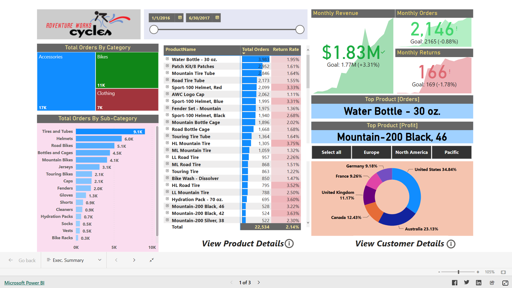
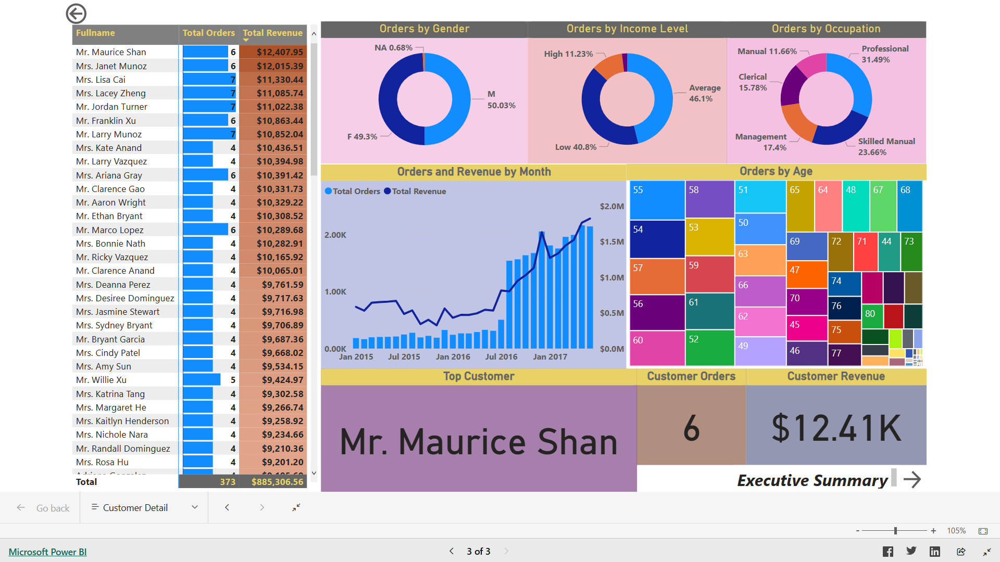

# 🚴 Adventure Works Cycles – Sales Performance Dashboard

## 🎯 Business Objective
To analyze sales performance, profitability, product pricing, order behavior, and return patterns in order to support business growth, pricing strategy, and operational decision-making.

---

## 📊 Dashboard Highlights
- Total Orders, Revenue, Cost & Profit
- Bulk Orders vs Single Orders
- Weekend vs Weekday Sales
- High-Ticket Orders Analysis
- Product Category & Model Performance
- YTD Revenue Trend
- Rolling Revenue & Profit KPIs
- Returns and Return Rate Analysis
- Price Adjustment & Profit Simulation
- Target vs Actual Performance

---

## 💡 Key Insights

1. **Bulk orders contribute significantly to total revenue**, indicating strong B2B or reseller purchasing behavior.  
2. **Weekend orders are lower in volume**, suggesting most purchases are made during business days.  
3. **High-ticket products generate fewer orders but contribute disproportionately to total revenue and profit.**  
4. **YTD revenue shows consistent growth**, with seasonal spikes indicating strong demand during peak periods.  
5. **Rolling 10-day revenue trends help identify short-term sales momentum**, while **90-day rolling profit highlights long-term profitability stability.**  
6. **Return rates are higher in the Bikes category**, indicating possible quality, sizing, or expectation mismatches.  
7. **Mid-range priced products drive the highest order volume**, while high-priced items drive profitability.  
8. **Target-based KPIs (10% MoM growth)** reveal periods where sales teams exceeded expectations and periods requiring intervention.  
9. **Price adjustment simulation shows potential revenue growth**, but profit sensitivity depends heavily on product cost structure.

---

## ✅ Business Recommendations

- Focus marketing campaigns on **mid-range products** to maximize order volume while maintaining steady profit.  
- Develop **special promotions for high-ticket items** to increase conversion without heavy discounting.  
- Strengthen **quality checks and return policy reviews for Bikes category** to reduce return rates.  
- Use **rolling KPIs for early detection of declining trends** and quick corrective actions.  
- Apply **dynamic pricing strategies** using adjusted price simulations to maximize profitability during high-demand periods.  
- Improve forecasting by using **target-based KPIs** to align sales and inventory planning.

---

## 🛠 Tools Used
- Power BI
- Excel / CSV Data Sources

---

## 📐 Key DAX Measures Used

### 🔹 Orders & Revenue

```DAX
Total Orders = DISTINCTCOUNT('AW_sales-2015-2017'[OrderNumber])

All Orders = CALCULATE([Total Orders], ALL('AW_sales-2015-2017'))

% of All Orders = [Total Orders] / [All Orders]

Bulk Orders =
CALCULATE([Total Orders], 'AW_sales-2015-2017'[OrderQuantity] > 1)

Weekend Orders =
CALCULATE([Total Orders], AW_Calendar_lookup[Weekend] = "Weekend")

Total Cost =
SUMX(
    'AW_sales-2015-2017',
    'AW_sales-2015-2017'[OrderQuantity] *
    RELATED(AW_Products_Lookup[ProductCost])
)

Total Revenue =
SUMX(
    'AW_sales-2015-2017',
    'AW_sales-2015-2017'[OrderQuantity] *
    RELATED(AW_Products_Lookup[ProductPrice])
)

Total Profit = [Total Revenue] - [Total Cost]

YTD Revenue =
CALCULATE([Total Revenue], DATESYTD(AW_Calendar_lookup[Date]))
```
# Targetting and Rolling KPI
```
Prev Month Orders =
CALCULATE([Total Orders], DATEADD(AW_Calendar_lookup[Date], -1, MONTH))

Order Target = [Prev Month Orders] * 1.1

Prev Month Revenue =
CALCULATE([Total Revenue], DATEADD(AW_Calendar_lookup[Date], -1, MONTH))

Revenue Target = [Prev Month Revenue] * 1.1

10 Day Rolling Revenue =
CALCULATE(
    [Total Revenue],
    DATESINPERIOD(
        AW_Calendar_lookup[Date],
        MAX(AW_Calendar_lookup[Date]),
        -10,
        DAY
    )
)

90 Day Rolling Profit =
CALCULATE(
    [Total Profit],
    DATESINPERIOD(
        AW_Calendar_lookup[Date],
        MAX(AW_Calendar_lookup[Date]),
        -90,
        DAY
    )
)
```
## Return Analysis 
```
Total Return = COUNTA(AW_Returns[ReturnQuantity])

ALL Returns = CALCULATE([Total Return], ALL(AW_Returns))

% of ALL Returns = [Total Return] / [ALL Returns]

Bike Returns =
CALCULATE(
    [Total Return],
    AW_Product_Category_lookup[CategoryName] = "Bikes"
)

QuantitySold = SUM('AW_sales-2015-2017'[OrderQuantity])

Quantity Returned = SUM(AW_Returns[ReturnQuantity])

Return Rate = [Quantity Returned] / [QuantitySold]

```
## Pricing & Product Segmentation
```
Avg. Retail Price = AVERAGE(AW_Products_Lookup[ProductPrice])

Overall Avg. Price =
CALCULATE([Avg. Retail Price], ALL(AW_Products_Lookup))

High Ticket Orders =
CALCULATE(
    [Total Orders],
    FILTER(AW_Products_Lookup, AW_Products_Lookup[ProductPrice] > [Overall Avg. Price])
)

Price Point =
IF(
    AW_Products_Lookup[ProductPrice] > 500, "High",
    IF(
        AW_Products_Lookup[ProductPrice] > 100 && AW_Products_Lookup[ProductPrice] < 500, "Mid Range",
        "Low"
    )
)

SKU Category =
LEFT(
    AW_Products_Lookup[ProductSKU],
    SEARCH("-", AW_Products_Lookup[ProductSKU]) - 1
)
```
🔗 Project Links

🌐 Live Power BI Dashboard:
👉 [Adventure Works Cycles – Sales Performance Dashboard](https://app.powerbi.com/view?r=eyJrIjoiOTg5OWMyNGQtNTViZC00ZmVmLTkwMGMtNzNkMDgyMjZkMTIwIiwidCI6Ijc3ZWYwMzdjLWU5N2MtNDUzZi04MmY2LTI0Y2M2NGViNGEyMCJ9)

📥 PBIX File:
👉 Not shared publicly to protect original work

📸 Dashboard Preview




⚠ Disclaimer

This dashboard is part of my personal portfolio and is intended for learning and demonstration purposes only.
Unauthorized commercial use or redistribution is not permitted.
