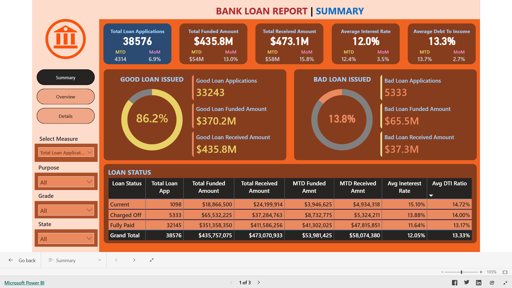
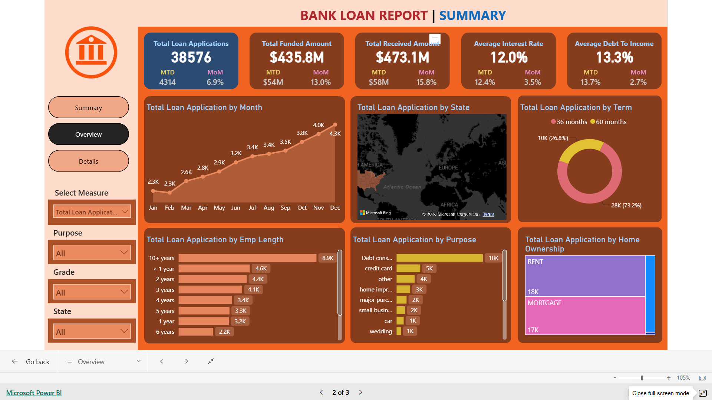

# 🏦 Bank Loan Analysis Dashboard

## 🎯 Business Objective
To analyze loan applications, funded amounts, repayments, loan quality, and borrower behavior to help banks make data-driven lending decisions, manage risk, and improve portfolio performance.

---

## 📊 Dashboard Highlights

### Executive Summary
- Total Loan Applications
- Total Funded Amount
- Total Received Amount
- Average Interest Rate
- Average Debt-to-Income Ratio
- Good Loan vs Bad Loan Analysis
- Loan Status Performance

### Loan Overview Analysis
- Loan Applications by Month
- Loan Applications by State
- Loan Applications by Purpose
- Loan Applications by Employment Length
- Loan Applications by Home Ownership
- Loan Applications by Loan Term

### Detailed Loan Analysis
- Loan-Level Transaction Records
- Purpose-wise Analysis
- Grade & Sub-Grade Analysis
- Funded vs Received Amount Analysis
- Interest Rate Analysis
- Installment Analysis

---

## 💡 Key Insights

### Portfolio Performance

1. A total of **38,576 loan applications** were processed.
2. The bank funded approximately **$435.8M** in loans.
3. Total repayments received reached **$473.1M**, indicating strong portfolio performance.
4. The average interest rate across all loans is **12.0%**.
5. Average Debt-to-Income (DTI) ratio stands at **13.3%**.

### Loan Quality Analysis

#### ✅ Good Loans
- Good Loans account for **86.2%** of total applications.
- More than **33K applications** fall under the Good Loan category.
- Good Loans generated:
  - **$370.2M Funded Amount**
  - **$435.8M Received Amount**

#### ⚠️ Bad Loans
- Bad Loans account for **13.8%** of total applications.
- Total Bad Loan Applications: **5,333**
- Total Bad Loan Funded Amount: **$65.5M**
- Total Bad Loan Received Amount: **$37.3M**

### Customer & Lending Behavior

1. Loan applications show a steady increase throughout the year, with **December recording the highest volume**.
2. **Debt Consolidation** is the most common purpose for applying for loans.
3. **Credit Card** and **Home Improvement** loans are among the next most popular categories.
4. Most applicants are either **Renters** or have an active **Mortgage**.
5. Customers with **10+ years of employment experience** account for the highest number of loan applications.
6. Around **73% of customers prefer 36-month loan terms**, while only **27% choose 60-month terms**.

---

## ✅ Business Recommendations

Based on the analysis, to improve lending performance and reduce risk:

- Continue prioritizing customer profiles associated with **Good Loans**, as they contribute significantly to portfolio profitability.
- Closely monitor **Bad Loan segments** to reduce future defaults and improve recovery rates.
- Develop targeted lending products for **Debt Consolidation** customers, as they represent the largest borrower segment.
- Create customized offers for **Renters** and **Mortgage Holders** to improve customer acquisition.
- Focus on applicants with strong employment histories while maintaining balanced lending criteria.
- Monitor **Debt-to-Income (DTI) ratios** during underwriting to minimize credit risk.
- Promote shorter-term loans where appropriate to improve repayment performance and reduce risk exposure.

---

## 🛠 Tools Used

- SQL
- Power BI
- DAX
- Data Modeling
- Data Cleaning & Transformation

---

## 📐 Key Metrics & Analysis

- Total Loan Applications
- Total Funded Amount
- Total Received Amount
- Good Loan %
- Bad Loan %
- Average Interest Rate
- Average Debt-to-Income Ratio
- Loan Status Analysis
- State-wise Analysis
- Purpose-wise Analysis
- Grade-wise Analysis
- Monthly Lending Trends

---

## 📁 Files

🔗 Project Links

🌐 Live Power BI Dashboard:
👉 [Bank_Loan_Analysis_Dashboard](https://app.powerbi.com/view?r=eyJrIjoiNTBmOWZlYjItYTk4MC00ZjAyLWEzMzgtMGZmYjlhNWNkOWVjIiwidCI6Ijc3ZWYwMzdjLWU5N2MtNDUzZi04MmY2LTI0Y2M2NGViNGEyMCJ9)

### 📸 Executive Summary

### 📸 Loan Overview

### 📸 Loan Details

---

## 📊 Skills Demonstrated

- SQL Querying
- Data Cleaning
- Data Modeling
- DAX Calculations
- Financial Analytics
- KPI Reporting
- Business Intelligence
- Dashboard Design
- Data Visualization
- Banking & Loan Analytics

⚠ Disclaimer

This dashboard is part of my personal portfolio and is intended for learning and demonstration purposes only.
Unauthorized commercial use or redistribution is not permitted.
