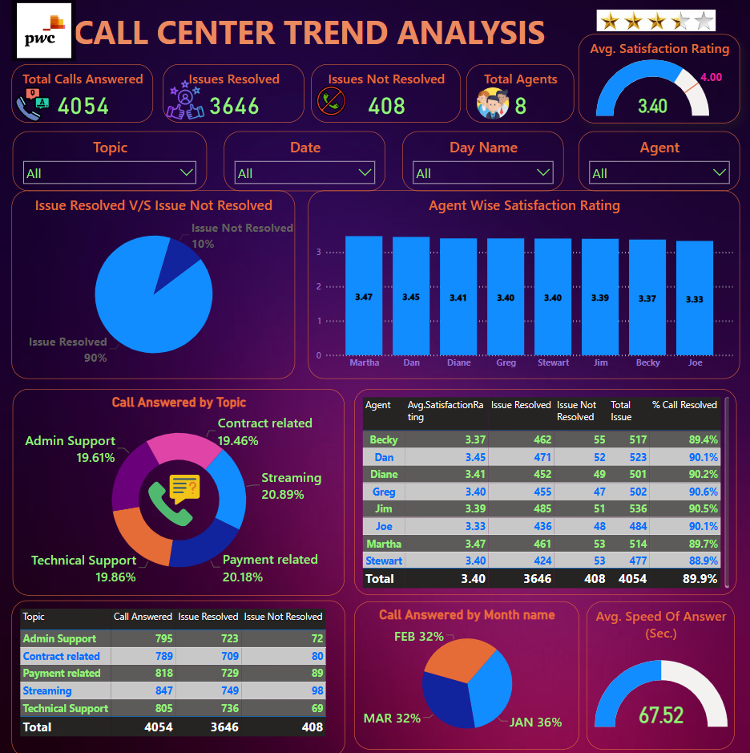

# 📞 Call Center Trend Analysis 

## 🎯 Business Objective
To analyze call center performance, agent efficiency, issue resolution rates, and customer satisfaction in order to improve service quality and optimize agent allocation.

---

## 📊 Dashboard Highlights
- Customer Satisfaction Rating by Agent
- Calls Resolved Percentage by Agent
- Issues by Topic Category
- Issue Resolution by Topic and Agent
- Monthly Call Volume Trend
- Agent Performance Comparison

---

## 💡 Key Insights

1. **Martha** recorded the highest customer satisfaction rating (**3.47**), while **Joe** recorded the lowest (**3.33**).  
2. **Jim and Greg** achieved the highest percentage of calls resolved among all agents.  
3. Maximum issues are related to **Streaming**, while minimum issues are related to **Admin Support**.  
4. Streaming-related issues show **lower resolution percentage overall**, and **Martha recorded the lowest resolution rate** in this category.  
5. In Streaming issues, **Stewart** has a good resolution percentage, but he received fewer issues compared to others and his customer satisfaction is only average.  
6. Maximum number of issues were generated during the month of **January**.  
7. For **Admin Support**, agents **Joe, Diane, and Dan** recorded the highest call resolution percentages.  
8. For **Contract and Payment-related issues**, **Martha and Greg** recorded the highest resolution percentages.  
9. For **Streaming and Technical Support**, **Stewart, Jim, and Dan** performed best in terms of resolution rates.

---

## ✅ Business Recommendations

To improve customer satisfaction and issue resolution in the upcoming year:

- Provide **targeted training programs** for agents with lower customer satisfaction ratings.  
- Implement **skill-based call routing**, ensuring that incoming issues are assigned to the most suitable agents.  
- Increase **technical training for streaming-related issues**, which currently have lower resolution rates.  
- Monitor **monthly trends**, especially high-volume months like January, and ensure adequate staffing.  
- Encourage knowledge sharing from high-performing agents to improve overall team performance.

---

## 🛠 Tools Used
- Power BI
- Excel Dataset

---

## 🔗 Project Links

🌐 **Live Power BI Dashboard:**  
👉 [Call Center Trend Analysis](https://app.powerbi.com/view?r=eyJrIjoiNDUxOTRhZDItYjA4MS00OWI3LTgwMWMtYjhjOGJmNDIwYjY2IiwidCI6Ijc3ZWYwMzdjLWU5N2MtNDUzZi04MmY2LTI0Y2M2NGViNGEyMCJ9)

📥 **PBIX File:**  
👉 Not shared publicly to protect original work

---

## 📸 Dashboard Preview

---

## ⚠ Disclaimer
This dashboard is part of my personal portfolio and is intended for learning and demonstration purposes only.  
Unauthorized commercial use or redistribution is not permitted.

