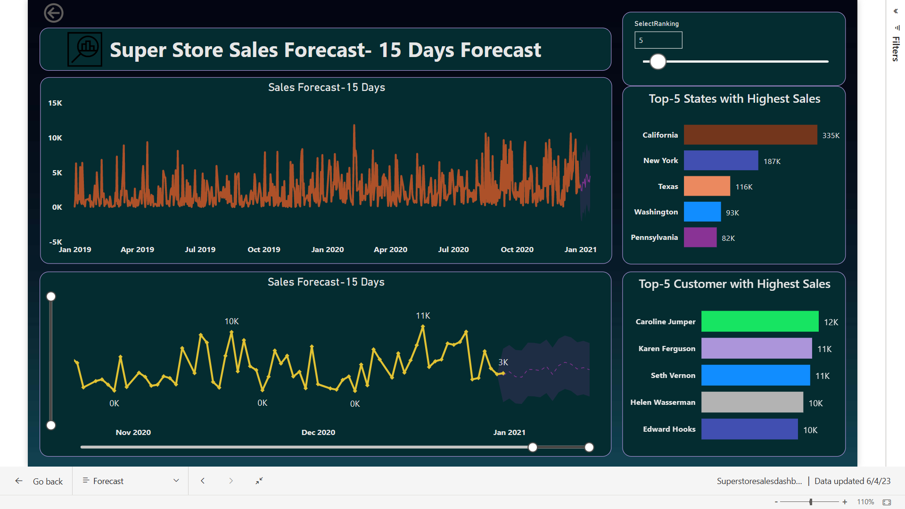

# 🛍 Super Store Sales Analysis Dashboard 

## 🎯 Business Objective
To analyze sales, profit, customer behavior, and regional performance to identify growth opportunities and improve operational efficiency.

---

## 📊 Dashboard Highlights
- Total Sales, Profit & Quantity Sold
- Region-wise and State-wise Performance
- Category and Sub-Category Analysis
- Customer Segment Performance
- Shipping Mode Impact on Profit
- Monthly Sales and Profit Trends
- Top and Bottom Performing Products

---

## 💡𝐔𝐬𝐞𝐟𝐮𝐥 𝐈𝐧𝐬𝐢𝐠𝐡𝐭𝐬 :
⚫Most of the customers preferred 𝐬𝐭𝐚𝐧𝐝𝐚𝐫𝐝 𝐜𝐥𝐚𝐬𝐬 ship mode.
⚫In Sub-Category, maximum sales are driven through "Phones" followed by "Chair".
⚫In category wise, maximum sales are of "Office Supplies".
⚫March month recorded the highest profit but on the contrary April month recorded the loss.
⚫Maximum sales are driven through 𝐂𝐎𝐃 𝐩𝐚𝐲𝐦𝐞𝐧𝐭 mode.
⚫Maximum sales are from the 𝐂𝐮𝐬𝐭𝐨𝐦𝐞𝐫 S𝐞𝐠𝐦𝐞𝐧𝐭 followed by 𝐜𝐨𝐫𝐩𝐨𝐫𝐚𝐭𝐞.
⚫"California" states have highest sales.
⚫"Caroline Jumper" is the most valuable customer by sales.

## 🎯 Conclusion:
👉 Finally based on the insights, to increase sales in upcoming year, we can suggest Super store consider the following:
📌 We should target 𝐬𝐭𝐚𝐧𝐝𝐚𝐫𝐝 𝐜𝐥𝐚𝐬𝐬 ship mode.
📌 We should produce more products in the categories offices, phones, chairs, binders etc. as they have the highest sales.
📌 We can target the top states and introduce more products along with discounts, and coupons that are exclusive to this locations.
📌 We can target the top customers and introduce gifts, offers along with discounts, and coupons.
📌March has the highest profit, so we should release new collection in this month.
📌April has the lowest profit, it might be due to "COVID-19 lockdown" but we have to take care of other factors as well.

---

## 🛠 Tools Used
- Power BI
- Excel / CSV Dataset

---

## 📊 KPIs Analyzed
- Total Sales
- Total Profit
- Profit Margin
- Quantity Sold
- Orders by Segment
- Orders by Region
- Shipping Cost Impact

---

## 🔗 Project Links

🌐 **Live Power BI Dashboard:**  
👉 [Super Store Sales Analysis Dashboard](https://app.powerbi.com/view?r=eyJrIjoiYTk3YWMzOWUtYTI3Zi00YWVhLWE5OGYtMDEwYTFlMWRkYzQyIiwidCI6Ijc3ZWYwMzdjLWU5N2MtNDUzZi04MmY2LTI0Y2M2NGViNGEyMCJ9)

---

## 📸 Dashboard Preview

---

